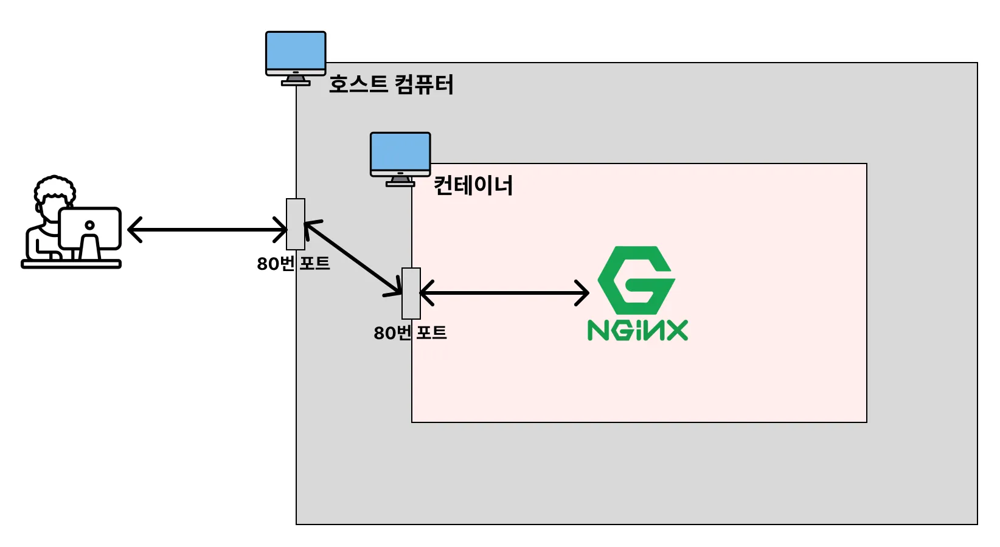
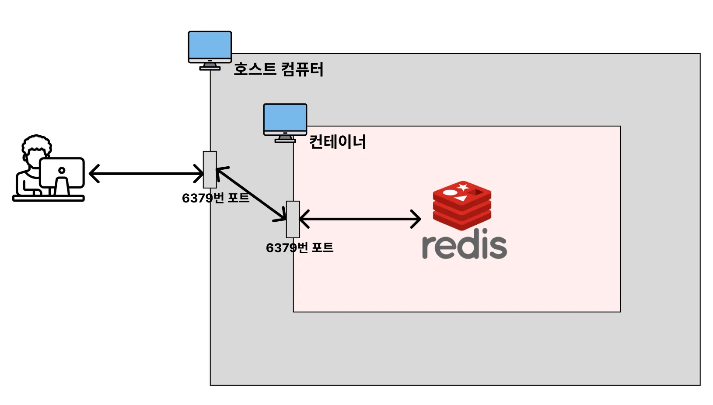

# Docker

### ✅Docker CLI

<details>
   <summary> 정리한 내용 보기 (👈 Click)</summary>
<br />

* 이미지 다운로드
  * `docker pull [이미지명]`
* 이미지 조회
  * `docker image ls`
* 이미지 삭제
  * `docker image rm [-f] [이미지명]`
* 컨테이너 생성 및 실행 : 
  * `docker create [이미지명]`
  * `docker start [컨테이너 ID]`
* 컨테이너 중단 및 삭제
  * `docker stop [컨테이너 ID]`
  * `docker rm [컨테이너 ID]`
* 컨테이너 이미지 다운로드 및 생성/실행
  * `docker run [이미지명]` : 포그라운드 실행
  * `docker run -d [이미지명]` : 백그라운드 실행
* 호스트 포트와 컨테이너 포트 바인딩하기
  * `docker run -d -p [호스트 포트 번호]:[컨테이너 포트 번호] [이미지명]`
* 실행 중인 컨테이너 조회
  * `docker ps`
* 중단된 컨테이너를 포함한 모든 컨테이너 조회
  * `docker ps -a`
* 도커 컨테이너 종료
  * `docker stop [컨테이너 ID]`
* 도커 컨테이너 로그 조회
  * `docker logs [컨테이너 ID]`
* 실행 중인 도커 컨테이너 내부에 접속
  * `docker exec -it [컨테이너 ID] bash`



* Docker Container가 어떻게 동작하는지에 대한 전체 프로세스를 이해
  * 클라이언트는 사용 중인 호스트 컴퓨터의 포트 번호 4000번으로 접속을 하게 되면 호스트 컴퓨터 내부의 컨테이너인 nginx 컨테이너의 포트 번호인 80번과 바인딩이 되면서 연결이 정상적으로 이루어진다.
  * 단, 클라이언트가 호스트 컴퓨터 내부의 nginx 컨테이너의 포트 번호 80번으로 직접 접속을 시도하게 되면 연결이 정상적으로 이루어지지 않는다.



* Docker Container가 어떻게 동작하는지에 대한 전체 프로세스를 이해
  * 호스트 컴퓨터의 6379번 포트와 컨테이너 내부의 6379번 포트를 바인딩하여 연결이 정상적으로 이루어진다.
  * 클라이언트가 호스트 컴퓨터의 6379번 포트로 접속을 하게 되면 컨테이너 내부의 레디스에 접근할 수 있게 된다.

-----------------------
</details>

### ✅Docker Volume

<details>
   <summary> 정리한 내용 보기 (👈 Click)</summary>
<br />

* 도커 컨테이너가 가지는 문제점
  * Docker를 활용하면 특정 프로그램을 컨테이너로 간편하게 띄울 수 있어 별도의 불필요한 설치를 안 거쳐도 된다.
  * 하지만 프로그램에 새로운 기능이 추가되면 새로운 이미지를 만들어서 컨테이너를 실행시키는데 이 때, Docker는 새로운 컨테이너를 만들어 통째로 갈아끼우는 방식으로 교체를 하기 때문에 데이터의 유실이 발생한다.
  * 컨테이너 내부에 저장된 데이터가 삭제되면 안되는 경우에는 볼륨(Volume)이라는 개념을 활용할 수 있다.
* Docker Volume이란, 도커 컨테이너 내부의 데이터를 영속적으로 저장하기 위한 수단이다.
* Volume은 컨테이너 내부 저장 공간을 사용하지 않고 호스트 저장 공간을 공유해서 사용하는 기법이다.

```dockerfile
docker run -e MYSQL_ROOT_PASSWORD=password -p 3306:3306 -v /Users/jwj/Desktop/개발/docker-mysql/mysql-data:/var/lib/mysql -d mysql
```

* `/Users/jwj/Desktop/개발/docker-mysql` 호스트 컴퓨터 저장 경로 하위에 `mysql-data` 디렉터리가 생성되면서 데이터가 저장이 된다. 
* 이 때, 데이터베이스의 초기 설정 비밀번호 역시 같이 저장되기 때문에 도커 컨테이너를 지우고 다시 설치하여 데이터베이스에 접속할 때 비밀번호를 바꾸게 되면 접속이 되지 않는다.
* 미리 디렉터리를 만들면 안된다. 이 점을 주의하자.

-----------------------
</details>

### ✅Dockerfile

<details>
   <summary> 정리한 내용 보기 (👈 Click)</summary>
<br />

* Dockerfile이란, Docker 이미지를 만들게 해주는 파일이다.

```dockerfile
FROM [이미지명]
FROM [이미지명]:[태그명]
```

[img_2.png](image/docker%20screenshot.png)

* Dockerfile을 기반으로 커스텀 이미지를 만들었으나 실제로 컨테이너를 조회해보면 아무것도 떠있지 않은 상황이 된다.
* 작업이 완료가 되면 컨테이너도 자동으로 종료가 된다.
* 제대로 테스트를 해보기 위해 아래와 같이 Dockerfile을 수정한다.

```dockerfile
FROM openjdk:21-jdk

# 아래 명령어를 추가하는 이유 : 컨테이너가 바로 종료되는 것을 막기 위함
# 500초 동안 시스템을 일시 정지 시키는 명령어
ENTRYPOINT ["/bin/bash", "-c", "sleep 500"]
```

#### COPY : 파일 복사(이동) & ENTRYPOINT : 컨테이너 실행 시 실행할 명령어 지정

* COPY는 호스트 컴퓨터에 있는 파일들을 복사해서 컨테이너로 전달하는 명령어다.

```dockerfile
FROM ubuntu

# COPY [호스트 컴퓨터에 있는 복사할 파일의 경로] [컨테이너에서 파일이 위치할 경로]
COPY My-App.txt /My-App.txt

ENTRYPOINT ["/bin/bash", "-c", "sleep 500"]
```

#### RUN vs ENTRYPOINT

* RUN 명령어는 이미지 생성 과정에서 필요한 명령어를 실행시킬 때 사용한다.
* ENTRYPOINT 명령어는 생성된 이미지를 기반으로 컨테이너를 생성한 직후에 명령어를 실행시킬 때 사용한다.

#### WORKDIR : 컨테이너 내부에서 작업할 디렉터리 지정

* WORKDIR로 작업 디렉터리를 전환하면 그 이후에 등장하는 모든 RUN, CMD, ENTRYPOINT, COPY, ADD 등의 명령문은 해당 디렉터리를 기준으로 실행된다.

#### EXPOSE : 컨테이너 내부에서 사용 중인 포트를 문서화하기

```dockerfile
EXPOSE [포트 번호]
```

-----------------------
</details>

### ✅Docker를 사용하여 백엔드(SpringBoot) 프로젝트를 실행시키기[프로젝트 목적]

<details>
   <summary> 정리한 내용 보기 (👈 Click)</summary>
<br />

* 호스트 컴퓨터에서 스프링 애플리케이션을 띄우는 것이 아니라 호스트 컴퓨터 내부의 컨테이너에 띄운다는 것이다.
* Dockerfile을 만들고 빌드된 파일을 컨테이너 내부로 복사할 수 있도록 하는 이미지를 만들어야 한다.
* 따라서 Dockerfile을 아래와 같이 작성한다.

```dockerfile
FROM openjdk:21-jdk

COPY /build/libs/*SNAPSHOT.jar app.jar

ENTRYPOINT ["java", "-jar", "/app.jar"]
```

[img_2](image/img_2.png)

* 주의사항은 바로 컨테이너를 실행시키는 순간에 있다. 클라이언트가 호스트 컴퓨터에 요청을 보내면 당연히 되겠지만 지금은 컨테이너 내부에서 스프링 애플리케이션이 실행되고 있는 상황이다.
* 별도의 설정을 해주지 않으면 당연히 클라이언트가 도커 컨테이너 내부에 직접 접속하는 것은 불가능하다.
* 따라서, 호스트 컴퓨터의 8080번 포트와 도커 컨테이너 내부에서 실행되는 스프링 애플리케이션 8080번 포트를 바인딩시켜서 컨테이너를 실행시켜준다.
* 로그를 살펴보면 빌드된 파일이 성공적으로 실행되면서 컨테이너 내부에서 스프링 애플리케이션이 잘 실행되는 것을 볼 수 있다.

```dockerfile
docker run -d -p 8080:8080 hello_server
```

[img_3](image/img_3.png)

-----------------------
</details>

### ✅Docker를 사용하여 프론트엔드(Next.js) 프로젝트를 배포하기[프로젝트 목적]

<details>
   <summary> 정리한 내용 보기 (👈 Click)</summary>
<br />

```dockerfile
FROM node:20-alpine

WORKDIR /app

COPY . .

RUN npm install

RUN npm run build

EXPOSE 3000

ENTRYPOINT ["npm", "run", "start"]
```

* 이 때, node_modules 파일은 `.dockerignore` 파일에 등록하여 버전 관리가 되지 않도록 한다.

-----------------------
</details>

### ✅Docker Compose

<details>
   <summary> 정리한 내용 보기 (👈 Click)</summary>
<br />

* Docker Compose는 여러 개의 컨테이너들을 하나의 서비스로 정의하고 구성해 하나의 묶음으로 관리할 수 있게 도와주는 툴이다.
* Docker Compose를 사용하는 이유 정리

  * 여러 개의 컨테이너를 관리하는 데 용이 : 여러 개의 컨테이너로 이루어진 복잡한 애플리케이션을 한 번에 관리할 수 있게 도와준다. 여러 컨테이너를 하나의 환경에서 실행하고 관리하는 데 도움이 된다.
  * 복잡한 명령어로 실행시키던 걸 간소화

-----------------------
</details>

### ✅Docker Compose CLI

<details>
   <summary> 정리한 내용 보기 (👈 Click)</summary>
<br />

#### docker-compose.yml 파일에 정의한 내용을 기반으로 컨테이너 실행시키기

```dockerfile
docker compose up       # 포그라운드에서 실행
docker compose up -d    # 백그라운드에서 실행        
```

#### Docker Compose로 실행시킨 컨테이너 확인하기

```dockerfile
docker compose ps       # 실행 중인 컨테이너 확인
docker compose ps -a    # 종료된 컨테이너 포함해서 전체 확인       
```

#### Docker Compose log 확인하기

```dockerfile
docker compose logs
```

#### 컨테이너 실행하기 전에 이미지 재빌드하기

```dockerfile
docker compose up --build       # 포그라운드에서 재빌드 실행하기
docker compose up -d --build    # 백그라운드에서 재빌드 실행하기
```

#### 도커 이미지 다운받기

```dockerfile
docker compose pull
```

#### 도커 컨테이너 종료하기

```dockerfile
docker compose down
```

-----------------------
</details>

### ✅예시를 통한 Docker Compose & application.yml 이해

<details>
   <summary> 정리한 내용 보기 (👈 Click)</summary>
<br />

```dockerfile
FROM openjdk:17-jdk

COPY build/libs/*SNAPSHOT.jar /app.jar

EXPOSE 8080

ENTRYPOINT ["java", "-jar", "/app.jar"]
```

```yaml
services:
  spring:
    build: .  # Dockerfile 위치와 같은 기준
    ports:
      - "8080:8080"
    # 주의 사항 : SpringBoot 애플리케이션이 실행되기 전에 먼저 MySQL 서버가 실행되어야 한다.
    # depends_on 옵션을 사용한다.
    depends_on:
      mysql:
        condition: service_healthy
      redis:
        condition: service_healthy

  redis:
    image: redis
    ports:
      - "6379:6379"
    healthcheck:
      test: ["CMD", "redis-cli", "ping"]
      interval: 5s
      retries: 10

  mysql:
    image: mysql
    environment:
      MYSQL_ROOT_PASSWORD: root
      MYSQL_DATABASE: mydb
    volumes:
      - ./mysql_data:/var/lib/mysql
    ports:
      - "3306:3306"
    healthcheck:
      test: ["CMD", "mysqladmin", "ping"]   # MySQL이 정상적으로 실행되는지를 확인    
      interval: 5s                          # 주기는 5초에 한 번 
      retries: 10                           # 최대 10번 재시도
```

```yaml
spring:
  datasource:
    url: jdbc:mysql://localhost:3306/mydb
    username: root
    password: pwd1234
    driver-class-name: com.mysql.cj.jdbc.Driver
```

-----------------------
</details>