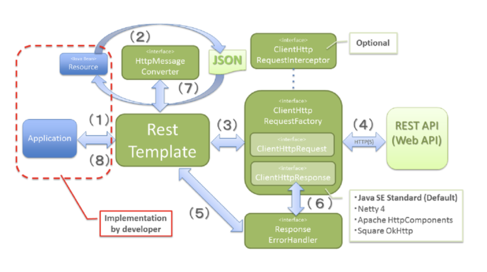

### ✅RestTemplate 정리

* RestTemplate란, Spring 3.0 버전부터 지원하는 라이브러리이다.
* 스프링에서 제공하는 HTTP 통신에 유용하게 사용할 수 있는 템플릿이며, HTTP 서버와의 통신을 단순화하고 RESTful 원칙을 지킨다.

### ✅RestTemplate 동작 원리

* `org.springframework.web.client` 패키지에 존재한다.
* HttpClient는 HTTP를 사용하여 통신하고 RestTemplate는 HttpClient를 추상화해서 제공해준다.
* 따라서 내부 통신(HTTP Connection)에 있어서는 Apache HttpComponents를 사용한다.
* 만약 RestTemplate가 없다면 직접 JSON, XML 라이브러리를 사용해서 변환해야 한다.



* 애플리케이션이 RestTemplate를 생성하고, URI, HTTP 메서드 등의 헤더를 담아 요청한다.
* RestTemplate는 HttpMessageConverter를 사용하여 Request Entity를 요청 메시지로 변환한다.
* RestTemplate는 ClientHttpRequestFactory로부터 ClientHttpRequest를 가져와서 요청을 보낸다.
* ClientHttpRequest는 요청 메시지를 만들어 HTTP 프로토콜을 통해 서버와 통신한다.
* RestTemplate는 ResponseErrorHandler로 오류 여부를 확인하고 있다면 처리 로직을 실행한다.
* ResponseErrorHandler는 오류가 있다면 ClientHttpResponse에서 응답 데이터를 가져와서 처리한다.
* RestTemplate는 HttpMessageConverter를 이용해서 응답 메시지를 Java 객체로 변환한다.
* 애플리케이션에 반환된다.

### ✅RestTemplate 사용 방법

* RestTemplate는 기본적으로 커넥션 풀을 사용하지 않는다.
* 따라서 연결할 때마다 포트를 열어 TCP 3-way handshaking을 통해 TCP Connection을 맺는다.
* 이 때, 문제는 `close()` 이후에 사용된 소켓은 TIME_WAIT 상태가 되는데 요청량이 많다면 소켓들을 재사용하지 못하고 응답이 지연되게 된다.
* 커넥션 풀을 사용하여 문제를 해결할 수 있다.
* `HttpComponentsClientHttpRequestFactory`는 Apache HttpComponents의 HttpClient를 사용하는 팩토리를 말한다.
* 커넥션 풀링을 지원하여 연결을 재사용할 수 있다.
* 커넥션을 재사용하면서 성능 향상을 도모할 수 있고 TCP 3-way handshake(논리적 연결) 연결 비용 감소, 리소스를 효율적으로 사용할 수 있다.
* 단, 커넥션 풀 크기를 너무 크게 잡으면 메모리 사용량이 증가하므로 커넥션 풀 크기는 적절히 설정해야 할 필요가 있다.

```java
@Configuration
public class RestTemplateConfig {

	@Bean
	public RestTemplate restTemplate() {
		HttpComponentsClientHttpRequestFactory factory = new HttpComponentsClientHttpRequestFactory();

		PoolingHttpClientConnectionManager connectionManager = new PoolingHttpClientConnectionManager();
		connectionManager.setMaxTotal(100);
		connectionManager.setDefaultMaxPerRoute(20);

		HttpClient httpClient = HttpClients.custom()
				.setConnectionManager(connectionManager)
				.evictExpiredConnections()
				.evictIdleConnections(TimeValue.ofSeconds(30))
				.build();

		factory.setHttpClient(httpClient);
		factory.setConnectionRequestTimeout(3000);
		factory.setConnectTimeout(3000);
		return new RestTemplate(factory);
	}
}
```