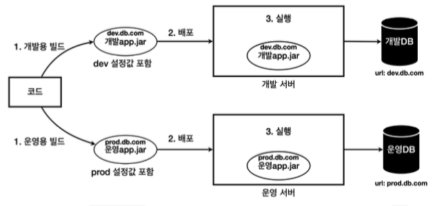
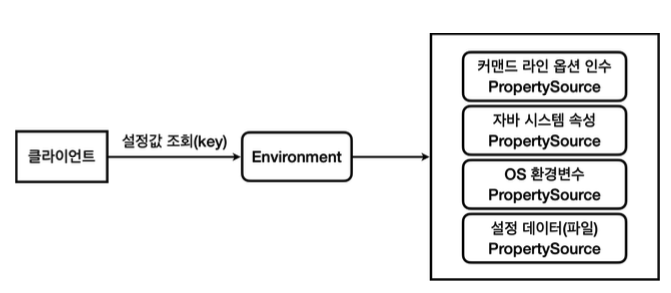
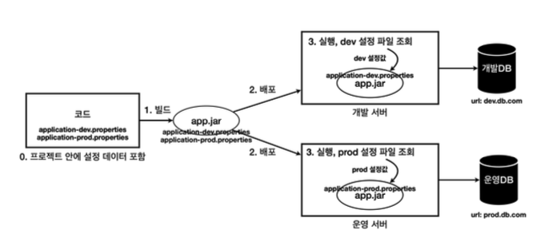
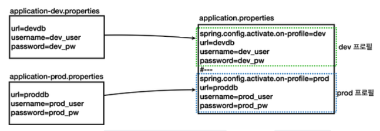

### ✅ 외부 설정과 프로필 1

* 하나의 애플리케이션을 여러 다른 환경에서 사용해야 할 때가 있다.
* 대표적으로 개발이 잘 되고 있는지를 내부에서 확인하는 용도의 개발 환경, 그리고 실제 고객에게 서비스하는 운영 환경이 있다.
  * 개발 환경 : 개발 서버, 개발 DB 사용
  * 운영 환경 : 운영 서버, 운영 DB 사용
* 문제는 각각의 환경에 따라서 서로 다른 설정값이 존재한다는 점이다.



* 환경에 따라서 빌드를 여러 번 해야 한다는 단점이 존재한다.
* 개발 버전과 운영 버전 빌드 결과물이 다르다. 따라서 개발 환경에서 검증이 되더라도 운영 환경에서 다른 빌드 결과를 사용하기 때문에 예상하지 못한 문제가 발생할 수 있다.
* 개발용 빌드가 끝나고 검증한 다음에 운영용 빌드를 해야 되는데 그 사이에 다른 개발자가 코드를 변경할 수 있다. 향후 다른 환경이 필요하다면 그곳에 맞도록 또 빌드를 해야 한다.

##### 유지보수하기 좋은 애플리케이션 개발의 가장 기본 원칙은 변하는 것과 변하지 않는 것을 분리하는 것이다.

* 유지보수하기 좋은 애플리케이션을 개발하는 단순하면서도 중요한 원칙은 변하는 것과 변하지 않는 것을 분리하는 것이다.
* 각 환경에 따라 변하는 외부 설정값을 분리하고 변하지 않는 코드와 빌드 결과물은 유지했다. 덕분에 빌드 과정을 줄이면서 환경에 따른 유연성을 확보할 수 있게 된다.

##### 외부 설정 방법 1 - OS 환경 변수

* OS 환경 변수(OS Environment variables)는 해당 OS를 사용하는 모든 프로그램에서 읽을 수 있는 설정값이다.
* 한 마디로 다른 외부 설정들과 비교해서 사용 범위가 가장 넓다.

```java
@Slf4j
public class OsEnv {

	public static void main(String[] args) {
		Map<String, String> getenv = System.getenv();
		for (String s : getenv.keySet()) {
			log.info("env {}={}", s, System.getenv(s));
		}
	}
}
```

* OS 환경 변수를 설정하고, 필요한 곳에서 `System.getenv()`를 사용하면 외부 설정을 사용할 수 있다.
* 이제 데이터베이스 접근 URL과 같은 정보를 OS 환경 변수에 설정해두고 읽어들이면 된다.
* 하지만 OS 환경 변수는 이 프로그램 뿐만 아니라 다른 프로그램에서도 사용된다.

##### 외부 설정 방법 2 - 자바 시스템 속성

* 자바 시스템 속성(Java System Properties)은 실행한 JVM 안에서 접근 가능한 외부 설정이다.
* 추가로 자바가 내부에서 미리 설정해두고 사용하는 속성들도 있다.
* 자바 시스템 속성은 다음과 같이 자바 프로그램을 실행할 때 사용한다.

```java
@Slf4j
public class JavaSystemProperty {

	public static void main(String[] args) {
		Properties properties = System.getProperties();
		for (Object o : properties.keySet()) {
			log.info("prop {}={}", o, System.getProperty(String.valueOf(o)));
		}

		String url = System.getProperty("url");
		String username = System.getProperty("username");
		String password = System.getProperty("password");
		
		log.info("url={}", url);
		log.info("username={}", username);
		log.info("password={}", password);
	}
}
```

* `-D` VM 옵션을 추가해서 key=value 형식으로 주면 된다.
* 이 방식은 코드 안에서 사용하는 것이기 때문에 외부로 설정을 분리하는 효과는 없다.

##### 외부 설정 방법 3 - 커맨드 라인 인수

* 커맨드 라인 인수는 애플리케이션 실행 시점에 외부 설정값을 `main(args)` 메서드의 `args` 파라미터로 전달하는 방법이다.

```java
@Slf4j
public class CommandLineV1 {

	public static void main(String[] args) {
		for (String arg : args) {
			log.info("arg {}", arg);
		}
	}
}
```

##### 외부 설정 방법 4 - 커맨드 라인 옵션 인수

* 옵션 인수는 `--username=userA --username=userB`처럼 하나의 키에 여러 값을 포함할 수 있다.
* 커맨드 라인 옵션 인수는 자바 언어의 표준 기능이 아니다. 스프링이 편리함을 위해 제공하는 기능이다.

```java
@Slf4j
public class CommandLineV2 {

	public static void main(String[] args) {
		for (String arg : args) {
			log.info("arg {}", arg);
		}

		DefaultApplicationArguments defaultApplicationArguments = new DefaultApplicationArguments(args);
		log.info("SourceArgs = {}", List.of(defaultApplicationArguments.getSourceArgs()));
		log.info("NonOptionArgs = {}", defaultApplicationArguments.getNonOptionArgs());
		log.info("OptionNames = {}", defaultApplicationArguments.getOptionNames());

		Set<String> optionNames = defaultApplicationArguments.getOptionNames();
		for (String optionName : optionNames) {
			log.info("option args {}={}", optionName, defaultApplicationArguments.getOptionValues(optionName));
		}
		List<String> url = defaultApplicationArguments.getOptionValues("url");
		List<String> username = defaultApplicationArguments.getOptionValues("username");
		List<String> password = defaultApplicationArguments.getOptionValues("password");
		List<String> mode = defaultApplicationArguments.getOptionValues("mode");
		log.info("url={}", url);
		log.info("username={}", username);
		log.info("password={}", password);
		log.info("mode={}", mode);
	}
}
```

##### 외부 설정 방법 5 - 커맨드 라인 옵션 인수와 스프링 부트

* 스프링 부트는 커맨드 라인을 포함해서 커맨드 라인 옵션 인수를 활용할 수 있는 `ApplicationArguments`를 스프링 빈으로 등록한다.
* 그리고 그 안에 입력한 커맨드 라인을 저장해둔다. 해당 빈을 주입 받으면 커맨드 라인으로 입력한 값을 어디서든지 사용할 수 있다.
* 옵션 인수들은 인텔리제이에서 `Program arguments`로 저장하면 된다.

```java
@Slf4j
@Component
public class CommandLineBean {

	private final ApplicationArguments arguments;

	public CommandLineBean(ApplicationArguments applicationArguments) {
		this.arguments = applicationArguments;
	}

	@PostConstruct
	public void init() {
		log.info("source {}", List.of(arguments.getSourceArgs()));
		log.info("optionNames {}", arguments.getOptionNames());
		Set<String> optionNames = arguments.getOptionNames();
		for (String optionName : optionNames) {
			log.info("option args {}={}", optionName,
					arguments.getOptionValues(optionName));
		}
	}
}
```

##### 외부 설정 - 스프링 통합

* 커맨드 라인 옵션 인수, 자바 시스템 속성, OS 환경변수는 모두 외부 설정을 `key=value` 형식으로 사용할 수 있는 방법이다.
* 그러나 어디에 있는 외부 설정값을 읽어야 하는지에 따라 각각 읽는 방법이 다르다는 단점이 있다.
* 외부 설정값이 어디에 위치하든지 상관없이 일관성 있고, 편리하게 `key=value` 형식의 외부 설정값을 읽을 수 있으면 사용하는 개발자 입장에서 더 편리하고 외부 설정값을 설정하는 방법도 더 유연해질 수 있다.
* 스프링은 이런 문제를 `Environment`와 `PropertySource`라는 추상화를 통해서 해결한다.



##### 설정 데이터 1 - 외부 파일

* `application.properties` 개발 서버에 있는 외부 파일

```properties
url=dev.db.com
username=dev_user
password=dev_pw
```

* `application.properties` 운영 서버에 있는 외부 파일

```properties
url=prod.db.com
username=prod_user
password=prod_pw
```

* 개발자가 파일을 읽어 설정값으로 사용할 수 있도록 개발을 해야겠지만 스프링 부트에서 이런 부분을 다 구현해두었다.
* 스프링에서는 이런 `application.properties` 파일을 설정 데이터(Config Data)라고 한다.
* 당연히 설정 데이터도 `Environment`를 통해서 조회가 가능하다.

```text
  .   ____          _            __ _ _
 /\\ / ___'_ __ _ _(_)_ __  __ _ \ \ \ \
( ( )\___ | '_ | '_| | '_ \/ _` | \ \ \ \
 \\/  ___)| |_)| | | | | || (_| |  ) ) ) )
  '  |____| .__|_| |_|_| |_\__, | / / / /
 =========|_|==============|___/=/_/_/_/

 :: Spring Boot ::                (v3.4.0)

2024-11-26T15:32:35.689+09:00  INFO 73385 --- [           main] com.jwj.external.ExternalApplication     : Starting ExternalApplication v0.0.1-SNAPSHOT using Java 17.0.13 with PID 73385 (/Users/jwj/Desktop/Backend_Study_TIL/external/build/libs/external-0.0.1-SNAPSHOT.jar started by jwj in /Users/jwj/Desktop/Backend_Study_TIL/external/build/libs)
2024-11-26T15:32:35.690+09:00  INFO 73385 --- [           main] com.jwj.external.ExternalApplication     : No active profile set, falling back to 1 default profile: "default"
2024-11-26T15:32:35.846+09:00  INFO 73385 --- [           main] com.jwj.external.CommandLineBean         : source []
2024-11-26T15:32:35.846+09:00  INFO 73385 --- [           main] com.jwj.external.CommandLineBean         : optionNames []
2024-11-26T15:32:35.847+09:00  INFO 73385 --- [           main] com.jwj.external.EnvironmentCheck        : env url=dev.db.com
2024-11-26T15:32:35.847+09:00  INFO 73385 --- [           main] com.jwj.external.EnvironmentCheck        : env username=dev_user
2024-11-26T15:32:35.847+09:00  INFO 73385 --- [           main] com.jwj.external.EnvironmentCheck        : env password=dev_pw
2024-11-26T15:32:35.879+09:00  INFO 73385 --- [           main] com.jwj.external.ExternalApplication     : Started ExternalApplication in 0.327 seconds (process running for 0.517)
```

##### 설정 데이터 2 - 외부 파일

* 설정 파일을 외부에서 관리하는 것은 상당히 번거롭다.
* 설정을 변경할 때마다 서버에 들어가서 각각의 변경 사항을 수정해두어야 한다.
* 실행 시점에 내부 설정 파일을 조회해서 해결할 수 있다.



* 프로젝트 안에 소스 코드 뿐만 아니라 각 환경에 필요한 설정 데이터도 함께 포함해서 관리한다.
  * 개발용 설정 파일 : `application-dev.properties`
  * 운영용 설정 파일 : `application-prod.properties`
* 빌드 시점에 개발, 운영 설정 파일을 모두 포함해서 빌드한다.
* `app.jar`는 개발, 운영 두 설정 파일을 모두 가지고 배포된다.
* 실행할 때 어떤 설정 데이터를 읽어야 할지 최소한의 구분은 필요하다.
  * 개발 환경이라면 `application-dev.properties`를 읽어야 하고, 운영 환경이라면 `application-prod.properties`를 읽어야 한다.
  * 실행할 때 외부 설정을 사용해서 개발 서버는 `dev`라는 값을 제공하고, 운영 서버는 `prod`라는 값을 제공하자. 편의상 이 값을 프로필이라고 하자.
* 외부 설정으로 넘어온 프로필 값에 따라 읽는 것이다.

---

* 프로필(profile)
  * 스프링은 이런 곳에서 사용하기 위해 프로필이라는 개념을 지원한다.
  * 프로필에 따라 다음과 같은 규칙으로 해당 프로필에 맞는 내부 파일을 조회하도록 설계되어 있다.
> application-{profile}.properties
* JAR 실행 방법
  * `./gradlew clean build`
  * build/libs로 이동
  * java -Dspring.profiles.active=dev -jar [JAR 파일명]
  * java -jar [JAR 파일명] --spring.profiles.active=dev

##### 설정 데이터 3 - 내부 파일 합체

* 위와 같이 분리하면 해결은 됐지만 설정 파일을 각각 분리해서 관리하자니 한눈에 전체가 들어오지 않는다는 단점이 있다.
* 스프링은 이런 단점을 보완하기 위해서 물리적인 하나의 파일 안에서 논리적으로 영역을 구분하는 방법을 제공한다.



* 기존에는 별도의 파일로 작성했으나 하나의 파일 안에서 `#---`으로 구분을 지어주면 분리가 가능하다.

```properties
### 개발용
spring.config.activate.on-profile=dev
url=dev.db.com
username=dev_user
password=dev_pw
#---
### 운영용
spring.config.activate.on-profile=prod
url=prod.db.com
username=prod_user
password=prod_pw
```

##### 우선순위 - 설정 데이터

* 프로필을 지정하지 않고 실행하면 스프링은 기본적으로 `default`라는 이름의 프로필을 사용하게 된다.
* 내 PC에서 개발하는 것을 보통 로컬(local) 개발 환경이라고 한다.
* 스프링은 문서를 위에서 아래로 순서대로 읽으면서 설정한다.

```properties
url=local.db.com
username=local_user
password=local_pw
#---
spring.config.activate.on-profile=dev
url=dev.db.com
username=dev_user
password=dev_pw
#---
spring.config.activate.on-profile=prod
url=prod.db.com
username=prod_user
password=prod_pw
```

* 특정 프로필을 지정하지 않은 경우에는 기본값이 사용되며 프로필을 지정한 경우 지정된 프로필이 우선권을 가진다.
* 단순하게 문서를 위에서 아래로 순서대로 읽으면서 값을 설정한다. 이 때, 기존 데이터가 있다면 덮어쓴다.
* 논리 문서에 `spring.config.activate.on-profile` 옵션이 있으면 해당 프로필을 사용할 때만 논리 문서를 적용한다.

##### 우선순위 - 전체

* [외부 설정에 대한 우선순위 - 스프링 공식 문서](https://docs.spring.io/spring-boot/reference/features/external-config.html#features.external-config)

### ✅ 외부 설정과 프로필 2

* 외부 설정
  * 설정 데이터(`application.properties`)
  * OS 환경 변수
  * 자바 시스템 속성
  * 커맨드 라인 옵션 인수
* 다양한 외부 설정 읽기
  * 스프링은 `Environment`는 물론이고 `Environment`를 활용해서 더 편리하게 외부 설정을 읽는 방법들을 제공한다.
* 스프링이 지원하는 다양한 외부 설정 조회 방법
  * `Environment`
  * `@Value` 어노테이션
  * `@ConfigurationProperties` 어노테이션 - 타입 안전한 설정 속성

##### 외부 설정 사용 - Environment

* 이 방식의 단점은 `Environment`를 직접 주입받아야 한다는 것이고, `env.getProperty(key)`를 통해서 값을 꺼내는 과정을 반복해야 한다는 점이다.
* 이런 단점을 해결하기 위해서 스프링은 `@Value` 어노테이션을 통해서 외부 설정값을 주입받는 더욱 편리한 기능을 제공한다.

```java
@Slf4j
@Configuration
public class MyDataSourceEnvConfig {

	private final Environment env;

	public MyDataSourceEnvConfig(Environment env) {
		this.env = env;
	}

	@Bean
	public MyDataSource dataSource() {
		String url = env.getProperty("my.datasource.url");
		String username = env.getProperty("my.datasource.username");
		String password = env.getProperty("my.datasource.password");
		int maxConnection = env.getProperty("my.datasource.etc.max-connection", Integer.class);
		List options = env.getProperty("my.datasource.etc.options", List.class);
		Duration timeout = env.getProperty("my.datasource.etc.timeout", Duration.class);
		return new MyDataSource(url, username, password, maxConnection, timeout, options);
	}
}
```

```properties
my.datasource.url=local.db.com
my.datasource.username=username
my.datasource.password=password
my.datasource.etc.max-connection=1
my.datasource.etc.timeout=3500ms
my.datasource.etc.options=CACHE,ADMIN
```

##### 외부 설정 사용 - @Value

* `application.properties`에 필요한 외부 설정을 추가하고, `@Value` 어노테이션을 통해서 해당 값들을 읽을 수 있다.
* `@Value` 어노테이션을 사용하는 방식도 좋지만, `@Value`로 하나하나 외부 설정 정보의 키를 입력받고, 주입 받아와야 하는 부분이 번거롭다.
* 그리고 설정 데이터를 보면 하나하나 분리되어 있는 것이 아니라 정보의 묶음으로 되어 있다. 묶인 부분 `my.datasource`을 객체로 변환해서 사용할 수 있다면 더 편리하고 좋을 것이다.

```java
@Slf4j
@Configuration
public class MyDataSourceValueConfig {

	@Value("${my.datasource.url}")
	private String url;
	@Value("${my.datasource.username}")
	private String username;
	@Value("${my.datasource.password}")
	private String password;
	@Value("${my.datasource.etc.max-connection}")
	private int maxConnection;
	@Value("${my.datasource.etc.timeout}")
	private Duration timeout;
	@Value("${my.datasource.etc.options}")
	private List<String> options;

	// ...
}
```

##### 외부 설정 사용 - @ConfigurationProperties

* 스프링은 외부 설정의 묶음 정보를 객체로 변환하는 기능을 제공한다. 이것을 **타입 안전한 설정 속성**이라 한다.
* 객체를 사용하면 타입을 사용할 수 있다. 따라서 실수로 잘못된 타입이 들어오는 문제도 방지할 수 있고, 객체를 통해서 활용할 수 있는 부분들이 많아진다.
* 외부 설정을 주입 받을 객체를 생성한다. 그리고 각 필드를 외부 설정의 키 값에 맞추어 준비한다.
* `@ConfigurationProperties` 어노테이션이 있으면 외부 설정을 주입 받을 객체라는 뜻이다. 여기에 외부 설정 KEY의 묶음 시작점인 `my.datasource`를 적어준다.
* 기본 주입 방식은 자바 빈 프로퍼티 방식이다. `@Getter`, `@Setter` 어노테이션이 필요하다.

```java
@Data   // @Getter, @Setter -> @Data 어노테이션에 의해 자동 생성
@ConfigurationProperties("my.datasource")
public class MyDatasourcePropertiesV1 {

	private String url;
	private String username;
	private String password;
	private Etc etc;

	@Data
	public static class Etc {
		private int maxConnection;
		private Duration timeout;
		private List<String> options = new ArrayList<>();
	}
}
```

##### 외부 설정 사용 - @ConfigurationProperties 생성자

* `@ConfigurationProperties` 어노테이션은 `@Getter`, `@Setter`을 사용하는 자바 빈 프로퍼티 방식이 아니라 생성자를 통해서 객체를 만드는 기능도 지원한다.
* `@DefaultValue` 어노테이션은 값을 찾을 수 없는 경우 내부에 들어가는 값을 비워둔다.

```java
@Data
@ConfigurationProperties("my.datasource")
public class MyDatasourcePropertiesV2 {

	private String url;
	private String username;
	private String password;
	private Etc etc;

	public MyDatasourcePropertiesV2(String url, String username, String password, @DefaultValue Etc etc) {
		this.url = url;
		this.username = username;
		this.password = password;
		this.etc = etc;
	}

	@Data
	public static class Etc {
		private int maxConnection;
		private Duration timeout;
		private List<String> options = new ArrayList<>();
	}
}
```

* 타입 문제들은 위와 같이 하면 해결이 되지만 타입은 맞는데 숫자의 범위가 기대하는 것과 다르면 어떻게 될까?
* max-connection과 같이 커넥션이 하나도 만들어지지 않는 문제가 발생할 수 있다는 것이다. 애플리케이션 로딩 시점에 예외를 발생시켜 빠르게 문제를 인지할 수 있도록 하는 것 역시 가능하다.

##### 외부 설정 사용 - @ConfigurationProperties 검증

* 숫자가 들어가야 하는 부분에 문자가 입력되는 문제와 같은 타입이 맞지 않는 데이터를 입력하는 문제는 예방이 가능하다.
* 하지만 문제는 숫자의 범위라던가 문자의 길이과 같은 부분은 검증이 어렵다.
* 자바에는 자바 빈 검증기(Java Bean Validation)라는 기능이 있다. 자바 빈 검증기라는 훌륭한 표준 검증기가 제공된다.
* ConfigurationProperties 장점
  * 외부 설정을 객체로 편리하게 변환해서 사용할 수 있다.
  * 외부 설정의 계층을 객체로 편리하게 표현할 수 있다.
  * 외부 설정을 타입 안전하게 사용할 수 있다.
  * 검증기를 적용할 수 있다.

##### YAML(YAML Ain't Markup Language)

* `application.properties`, `application.yml`을 같이 사용하면 `application.properties`가 우선권을 가진다.
* 둘이 함께 사용하는 것은 권장하지 않으며, 설정 정보가 많아 보기 편하기 위해 `yml` 사용을 권장한다.

```yaml
my:
  datasource:
    url: local.db.com
    username: local_user
    password: local_pw
    etc:
      maxConnection: 2
      timeout: 60s
      options: LOCAL, CACHE
---
spring:
  config:
    activate:
      on-profile: dev
my:
  datasource:
    url: dev.db.com
    username: dev_user
    password: dev_pw
    etc:
      maxConnection: 10
      timeout: 60s
      options: DEV, CACHE
---
spring:
  config:
    activate:
      on-profile: prod
my:
  datasource:
    url: prod.db.com
    username: prod_user
    password: prod_pw
    etc:
      maxConnection: 50
      timeout: 10s
      options: PROD, CACHE
```

##### @Profile

* 각 환경마다 서로 다른 빈을 등록할 때 사용하는 어노테이션이다.

```java
@Slf4j
@Configuration
public class PayConfig {

	@Bean
	@Profile("default") // 프로필 지정(로컬)
	public LocalPayClient localPayClient() {
		log.info("LocalPayClient 빈 등록");
		return new LocalPayClient();
	}

	@Bean
	@Profile("prod")    // 프로필 지정(운영)
	public ProdPayClient prodPayClient() {
		log.info("ProdPayClient 빈 등록");
		return new ProdPayClient();
	}
}
```

* 기본적으로 실행하게 되면 default 프로필로 결정되기 때문에 실행 결과는 아래와 같다.

```text
2024-11-26T18:22:29.494+09:00  INFO 79423 --- [           main] com.jwj.external.ExternalApplication     : No active profile set, falling back to 1 default profile: "default"
2024-11-26T18:22:29.630+09:00  INFO 79423 --- [           main] com.jwj.external.pay.PayConfig           : LocalPayClient 빈 등록
2024-11-26T18:22:29.659+09:00  INFO 79423 --- [           main] com.jwj.external.ExternalApplication     : Started ExternalApplication in 0.291 seconds (process running for 0.465)
2024-11-26T18:22:29.660+09:00  INFO 79423 --- [           main] com.jwj.external.pay.LocalPayClient      : 로컬 결제 money=1000
```

* VM 옵션을 통해서 운영 옵션으로 프로필을 지정해주면 실행 결과는 아래와 같다.


