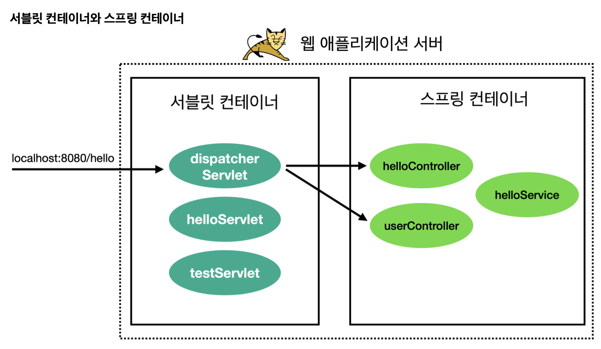
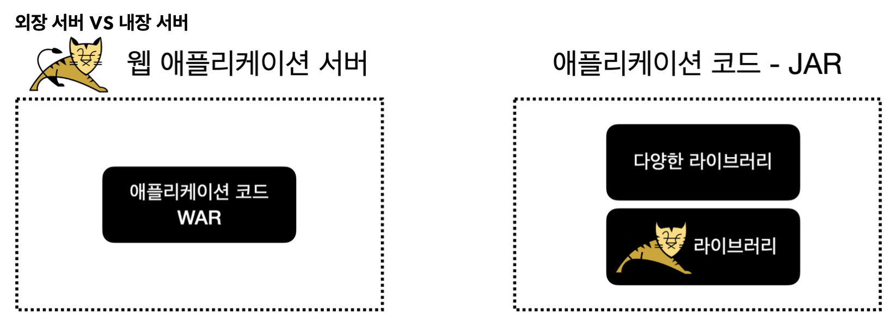

### ✅ 스프링 부트 - 핵심 기능 5가지

* WAS : Tomcat과 같은 웹 서버를 내장해서 별도의 웹 서버를 설치하지 않아도 됨 
* 라이브러리 관리 : 손쉬운 빌드 구성을 위한 스타터 종속성 제공, 스프링과 외부 라이브러리 버전을 자동으로 관리
* 자동 구성 : 프로젝트 시작에 필요한 스프링과 외부 라이브러리 빈을 자동 등록
* 외부 설정 : 환경 구성 
* 프로덕션 준비 : 모니터링을 위한 메트릭, 상태 확인 기능 제공

### ✅ 스프링 프레임워크와 스프링 부트

* 스프링 부트는 스프링 프레임워크를 쉽게 사용할 수 있도록 도와주는 도구일 뿐이다.
* 본질은 스프링 프레임워크이며, 스프링 부트가 제공하는 편의 기능이 너무 막강해서 스프링 부트 사용은 필수이다.

### ✅ 웹 서버와 서블릿 컨테이너

##### 웹 애플리케이션의 서블릿 컨테이너와 스프링 컨테이너 구조



* 8080번 포트로 요청을 보내면 Dispatcher Servlet(디스패처 서블릿)이 요청을 받아서 적절한 컨트롤러로 요청을 전달

### ✅ 스프링 부트와 내장 톰켓

* 웹 애플리케이션을 개발하고 배포하려면 다음과 같은 과정을 거친다.
  * 톰켓과 같은 웹 애플리케이션 서버(WAS)를 별도로 설치해야 한다.
  * 애플리케이션 코드를 WAR로 빌드해야 한다.
  * 빌드한 WAR 파일을 WAS에 배포해야 한다.
* 하지만 위와 같은 방식을 다음과 같은 단점이 있다.
  * 톰켓과 같은 WAS를 별도로 설치해야 한다.
  * 개발 환경 설정이 복잡하다.
    * 단순한 자바라면 별도의 설정을 고민하지 않고 `main()` 메서드만 실행하면 된다.
    * 웹 애플리케이션은 WAS로 실행하고 또 WAR와 연동하기 위한 복잡한 설정이 들어간다.
  * 배포 과정이 복잡하다.
  * 톰켓 버전 변경시 톰켓을 다시 설치해야 한다.

##### 외장 서버 vs 내장 서버



* 왼쪽 방식은 웹 애플리케이션 서버에 WAR 파일을 배포하는 방식
* 오른쪽 방식은 애플리케이션 JAR 안에 다양한 라이브러리들과 WAS 라이브러리가 포함되는 방식으로 `main()` 메서드를 실행시켜 동작한다.

##### 스프링 부트와 웹 서버 - 빌드와 배포

* `./gradlew clean build`
* `java -jar spring-0.0.1-SNAPSHOT.jar`

##### 스프링 부트 실행 가능 Jar

* 실행 가능 Jar가 아니라 IDE에서 직접 실행할 때는 `BootApplication.main()` 을 바로 실행한다.
* IDE가 필요한 라이브러리를 모두 인식할 수 있도록 도와주기 때문에 `JarLauncher`가 필요하지 않다.

### ✅ 스프링 부트 스타터와 라이브러리 관리

##### 스프링 부트 라이브러리 버전 관리

```yml
plugins {
	id 'java'
	id 'org.springframework.boot' version '3.4.0'
	id 'io.spring.dependency-management' version '1.1.6'
}
```

* 버전 관리 기능을 사용하려면 `io.spring.dependency-management` 플러그인을 사용해야 한다.
* 이렇게 해주면 라이브러리 버전은 생략해도 된다. 그러면 스프링 부트가 버전에 맞춘 최적화된 라이브러리 버전을 선택해준다.

##### dependency-management 버전 관리

* `io.spring.dependency-management` 플러그인을 사용하면 `spring-boot-dependencies`에 있는 다음 bom 정보를 참고한다.
* 버전 정보 bom
  * `https://github.com/spring-projects/spring-boot/blob/main/spring-boot-project/spring-boot-dependencies/build.gradle`
  * 해당 `build.gradle` 문서 안에 보면 bom이라는 항목이 있다.
  * 각각의 라이브러리에 대한 버전이 명시된 것을 볼 수 있다.
  * 물론 현재 프로젝트에서 지정한 스프링 부트 버전을 참고한다.
  * 스프링 부트 버전을 변경하면 나머지 라이브러리들의 버전도 자동으로 변경된다.
* BOM
  * 자재 명세서(Bill of materials)란 제품 구성하는 모든 부품들에 대한 목록이다.
  * 부품이 복잡한 요소들로 구성된 조립품인 경우는 계층적인 구조로 나눌 수 있다.
* 스프링 부트가 관리하는 외부 라이브러리 버전을 확인하는 방법
  * `https://docs.spring.io/spring-boot/docs/current/reference/html/dependency-versions.html#appendix.dependency-versions.coordinates`
* 스프링 부트가 관리하지 않는 외부 라이브러리의 경우 버전을 직접 명시해야 한다.
  * `implementation 'org.yaml:snakeyaml:1.30'`

##### 스프링 부트 스타터 - 자주 사용되는 것 위주로다가 정리

* `spring-boot-starter` : 핵심 스타터, 자동 구성, 로깅, YAML
* `spring-boot-starter-jdbc` : JDBC, HikariCP 커넥션 풀
* `spring-boot-starter-data-jpa` : 스프링 데이터 JPA, 하이버네이트
* `spring-boot-starter-data-mongodb` : 스프링 데이터 몽고
* `spring-boot-starter-data-redis` : 스프링 데이터 Redis, Lettuce 클라이언트
* `spring-boot-starter-thymeleaf` : 타임리프 뷰와 웹 MVC
* `spring-boot-starter-web` : 웹 구축을 위한 스타터, RESTful, 스프링 MVC, 내장 톰켓
* `spring-boot-starter-validation` : 자바 빈 검증기
* `spring-boot-starter-batch` : 스프링 배치를 위한 스타터

### ✅ 자동 구성(Auto Configuration)

```java
@Slf4j
@Configuration
public class DbConfig {

	@Bean
	public DataSource dataSource() {
		log.info("dataSource 빈 등록");
		HikariDataSource hikariDataSource = new HikariDataSource();
		hikariDataSource.setDriverClassName("org.h2.Driver");
		hikariDataSource.setJdbcUrl("jdbc:h2:mem:test");
		hikariDataSource.setUsername("sa");
		hikariDataSource.setPassword("");
		return hikariDataSource;
	}

	// 트랜잭션 매니저 등록
	@Bean
	public TransactionManager transactionManager() {
		log.info("transactionManger 빈 등록");
		return new JdbcTransactionManager(dataSource());
	}

	// JdbcTemplate 등록
	@Bean
	public JdbcTemplate jdbcTemplate() {
		log.info("jdbcTemplate 빈 등록");
		return new JdbcTemplate(dataSource());	
	}
}
```

* `JdbcTemplate`을 사용해서 회원 데이터를 DB에 보관하고 관리하는 기능이다.
* `DataSource`, `JdbcTemplate`, `TransactionManager`을 스프링 빈으로 직접 등록한다.
* 빈 등록이 실제로 되었는지 확인하기 위해 로그를 추가해준다.
* DB는 별도의 외부 DB가 아니라 JVM 내부에서 동작하는 메모리 DB(H2)를 사용한다.
* `@Configuration` 애노테이션을 붙여주면 스프링 빈으로 등록된다.

```sql
2024-11-25T22:18:22.768+09:00  INFO 61613 --- [           main] com.jwj.spring.config.DbConfig           : dataSource 빈 등록
2024-11-25T22:18:23.118+09:00  INFO 61613 --- [           main] com.jwj.spring.config.DbConfig           : jdbcTemplate 빈 등록
2024-11-25T22:18:23.131+09:00  INFO 61613 --- [           main] com.jwj.spring.config.DbConfig           : transactionManger 빈 등록
```

* 회원 데이터를 DB에 보관하고 관리하기 위해 앞서 스프링 빈으로 등록한 `JdbcTemplate`, `DataSource`, `TransactionManager`가 모두 사용되었다.
* 그런데 생각해보면 DB에 데이터를 보관하고 관리하기 위해 이런 객체들을 항상 스프링 빈으로 등록해야된다는 번거로움이 있다.
* 만약 DB를 사용하는 다른 프로젝트를 진행한다면 이런 객체들을 또 스프링 빈으로 등록해야 될 것이다.

```java
@Slf4j
@SpringBootTest
class DbConfigTest {

	@Autowired private DataSource dataSource;
	@Autowired private TransactionManager transactionManager;
	@Autowired private JdbcTemplate jdbcTemplate;

	@Test
	void checkBean() {
		log.info("dataSource = {}", dataSource);
		log.info("transactionManager = {}", transactionManager);
		log.info("jdbcTemplate = {}", jdbcTemplate);

		assertThat(dataSource).isNotNull();
		assertThat(transactionManager).isNotNull();
		assertThat(jdbcTemplate).isNotNull();
	}
}
```

* `DbConfig` 설정을 통해 스프링 컨테이너에 등록했기 때문에 Null이면 안 된다.
* 출력 결과를 보면 모두 스프링 빈으로 정상 등록된 것을 볼 수 있다.
* `@Configuration` 어노테이션을 주석 처리하고 테스트를 실행해보더라도 스프링 빈으로 등록되는 것을 볼 수 있다.
 
```sql
2024-11-25T22:30:00.886+09:00  INFO 61998 --- [           main] com.jwj.spring.config.DbConfigTest       : dataSource = HikariDataSource (HikariPool-1)
2024-11-25T22:30:00.886+09:00  INFO 61998 --- [           main] com.jwj.spring.config.DbConfigTest       : transactionManager = org.springframework.jdbc.support.JdbcTransactionManager@19f497aa
2024-11-25T22:30:00.886+09:00  INFO 61998 --- [           main] com.jwj.spring.config.DbConfigTest       : jdbcTemplate = org.springframework.jdbc.core.JdbcTemplate@1a3b1f7e
```

##### 스프링 부트의 자동 구성(Auto Configuration)

```java
@AutoConfiguration(
    after = {DataSourceAutoConfiguration.class}
)
@ConditionalOnClass({DataSource.class, JdbcTemplate.class})
@ConditionalOnSingleCandidate(DataSource.class)
@EnableConfigurationProperties({JdbcProperties.class})
@Import({DatabaseInitializationDependencyConfigurer.class, JdbcTemplateConfiguration.class, NamedParameterJdbcTemplateConfiguration.class})
public class JdbcTemplateAutoConfiguration {
    public JdbcTemplateAutoConfiguration() {
    }
}
```

* `@AutoConfiguration` : 자동 구성을 사용하려면 해당 어노테이션을 사용해야 한다.
  * 자동 구성도 내부에 `@Configuration` 어노테이션이 있어 빈을 등록하는 자바 설정 파일로 사용이 가능하다.
  * `after = {DataSourceAutoConfiguration.class}` : 자동 구성이 실행되는 순서를 지정할 수 있다. `JdbcTemplate`는 `DataSource`가 있어야 동작하기 때문에 `DataSource`를 자동으로 등록해주는 `DataSourceAutoConfiguration` 다음에 실행하도록 설정되어 있다.
* `@ConditionalOnClass({DataSource.class, JdbcTemplate.class})` : IF문과 유사한 기능을 제공한다. 이런 클래스가 있는 경우에만 설정이 동작한다. 만약 없으면 여기 있는 설정들이 무효화되고, 빈도 등록되지 않는다.
* `@Import` : 스프링에서 자바 설정을 추가할 때 사용한다.

---

* `@Conditional` : 특정 조건에 맞을 때 설정이 동작하도록 한다.
* `@AutoConfiguration` : 자동 구성이 어떻게 동작하는지 내부 원리 이해

##### 자동 구성 직접 만들기

```java
@Slf4j
public class MemoryFinder {

	public Memory get() {
		long max = Runtime.getRuntime().maxMemory();;
		long total = Runtime.getRuntime().totalMemory();
		long free = Runtime.getRuntime().freeMemory();
		long used = total - free;
		return new Memory(used, max);
	}

	@PostConstruct
	public void init() {
		log.info("init memoryFinder");
	}
}
```

* max : JVM이 사용할 수 있는 최대 메모리, 이 수치를 넘어가면 OOM이 발생한다.
* total : JVM이 확보한 전체 메모리, max까지 다 확보하지 않고 필요할 때마다 조금씩 확보한다.
* free : total 중에 사용하지 않은 메모리(JVM이 확보한 전체 메모리 중에 사용하지 않은 것)
* used : JVM이 사용 중인 메모리이다.

##### @Conditional 어노테이션

* 위와 같이 만든 메모리 사용 조회 기능을 항상 사용하는 것이 아니라 특정 조건일때만 해당 기능이 활성화되도록 해보자.
* 예를 들어 개발 서버에서 확인 용도로만 사용하고 운영 서버에서는 해당 기능을 사용하지 않는 것이다.
* 같은 소스 코드인데 특정 상황일때만 특정 빈들을 등록해서 사용하도록 도와주는 기능이 바로 `@Conditional` 어노테이션이다.
* `@Conditional` 어노테이션의 내부 구조는 아래와 같다.

```java
@FunctionalInterface
public interface Condition {
    boolean matches(ConditionContext context, AnnotatedTypeMetadata metadata);
}
```

* 함수형 인터페이스로 단 하나의 메서드만 가지는 형태를 보인다.
* `matches()` 메서드가 true를 반환하면 조건에 만족해서 동작하는 것이고 만약 false를 반환하면 동작하지 않는다.
* 인텔리제이의 VM Option을 추가해서 `-Dmemory=on`를 사용하면 조건을 만족하면서 메모리 사용량 조회가 가능해지는 것을 볼 수 있다.

```java
@Configuration
@ConditionalOnProperty(name = "memory", havingValue = "on")
public class MemoryConfig {

	@Bean
	public MemoryController memoryController() {
		return new MemoryController(memoryFinder());
	}

	@Bean
	public MemoryFinder memoryFinder() {
		return new MemoryFinder();
	}
}
```

* `@ConditionOnProperty` 어노테이션 역시 내부에 `@Conditional` 어노테이션이 존재한다.
* 이와 같은 비슷한 구현체들이 존재한다. `@ConditionalOnXxx` 형태
* [@ConditionalOnXxx 어노테이션 레퍼런스](https://docs.spring.io/spring-boot/reference/features/developing-auto-configuration.html#features.developing-auto-configuration.condition-annotations)

##### 순수 라이브러리 만들기

* 만들어진 라이브러리를 다음 명령어로 빌드

```java
./gradlew clean build
```

* 빌드 결과

```java
build/libs/JAR파일명
```

* 압축을 풀고 내용을 확인하기

```java
jar -xvf JAR파일명
```

* JAR 파일은 스스로 동작하지 못하고 다른 곳에 포함되어 동작하는 라이브러리

```java
import com.jwj.customLibrary.memory.MemoryController;           // 커스텀 라이브러리 개발한 것 임포트
import com.jwj.customLibrary.memory.MemoryFinder;               // 커스텀 라이브러리 개발한 것 임포트
import org.springframework.context.annotation.Bean;
import org.springframework.context.annotation.Configuration;

@Configuration
public class MemoryConfig {

	@Bean
	public MemoryFinder memoryFinder() {
		return new MemoryFinder();
	}

	@Bean
	public MemoryController memoryController() {
		return new MemoryController(memoryFinder());
	}
}
```

* 외부 라이브러리를 직접 만들고 또 그것을 프로젝트에 라이브러리로 불러서 적용할 수 있었다.
* 하지만 위의 코드를 보게 되면 라이브러리 코드 내부에 있는 것들을 스프링 빈으로 모두 등록해야 하는데 지금과 같이 간단한 라이브러리가 아니라면 초기 설정이 상당히 복잡할 수 있다.
* 이런 부분을 자동으로 처리해주는 것이 바로 스프링 부트 자동 구성이다.

##### 자동 구성 라이브러리 만들고 사용하기

```java
@AutoConfiguration
@ConditionalOnProperty(name = "memory", havingValue = "on")
public class MemoryConfig {

	@Bean
	public MemoryFinder memoryFinder() {
		return new MemoryFinder();
	}

	@Bean
	public MemoryController memoryController() {
		return new MemoryController(memoryFinder());
	}
}
```

* `@AutoConfiguration` : 스프링 부트가 제공하는 자동 구성 기능을 적용할 때 사용하는 어노테이션이다.
* `@ConditionalOnProperty`
  * `memory=on`이라는 환경 정보가 있을 때, 라이브러리를 적용한다.
  * 라이브러리를 가지고 있더라도 상황에 따라서 해당 기능을 켜고 끌 수 있게 유연한 기능을 제공한다.

##### 자동 구성 이해 - ImportSelector

* 정적인 방법 : `@Import(클래스)` 방식이 바로 정적 방식이다. 코드에 대상이 박혀 있다. 설정으로 사용할 대상을 동적으로 변경할 수 없다.
* 동적인 방법 : `@Import(ImportSelector)` 코드로 프로그래밍해서 설정으로 사용할 대상을 동적으로 선택할 수 있다.
* 정적인 방법
  * 스프링에서 다른 설정 정보를 추가하고 싶으면 아래와 같이 작성할 수 있다.
```java
@Configuration
@Import({AConfig.class, BConfig.class})
public class AppConfig() {
	// ...	
}
```
* 동적인 방법
  * 스프링은 설정 정보 대상을 동적으로 선택할 수 있는 `ImportSelector` 인터페이스를 제공한다.
```java
public interface ImportSelector {
	String[] selectImports(AnnotationMetadata importingClassMetadata);
}
```

##### @EnableAutoConfiguration 어노테이션

```java
@Target({ElementType.TYPE})
@Retention(RetentionPolicy.RUNTIME)
@Documented
@Inherited
@AutoConfigurationPackage
@Import({AutoConfigurationImportSelector.class})    // 설정 정보를 동적으로 선택
public @interface EnableAutoConfiguration {
    String ENABLED_OVERRIDE_PROPERTY = "spring.boot.enableautoconfiguration";

    Class<?>[] exclude() default {};

    String[] excludeName() default {};
}
```